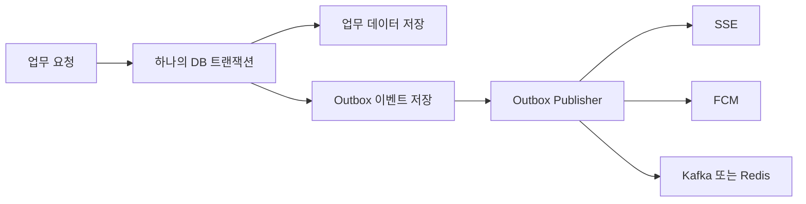

# Spring 실전: Transactional Outbox 패턴으로 이벤트 유실 막기

> 이 글에서는 DB 저장과 Kafka, Redis, FCM, SSE 같은 외부 이벤트 발행 사이에서 발생하는 `dual-write` 문제를 이해하고, Spring Boot에서 Transactional Outbox 패턴을 단계적으로 구현해보겠습니다.
>
> 먼저 읽어보시면 좋은 글: [SpringBoot 입문 11: 트랜잭션(@Transactional) 기본과 흔한 오해](/springboot/mvc-transaction-basics)
> 함께 보면 좋은 글: [SpringBoot 입문 27: 이벤트 기반 처리와 @Async](/springboot/mvc-async-event-listener)

애플리케이션을 만들다 보면 데이터를 저장한 직후 다른 시스템에 소식을 알려야 하는 요구사항을 자주 만나게 됩니다. 주문을 저장한 뒤 Kafka에 `ORDER_CREATED` 이벤트를 보내거나, 데이터 분석이 끝난 뒤 FCM 푸시 알림을 보내거나, 현재 접속 중인 화면에 SSE 이벤트를 전달하는 흐름이 대표적입니다.

처음에는 DB 저장 다음 줄에서 이벤트를 발행하면 충분해 보입니다.

```java
analysisRepository.save(completedAnalysis);
realtimeEventService.publish(completedAnalysis);
```

하지만 이 두 줄은 하나의 원자적인 작업이 아닙니다. 첫 번째 줄과 두 번째 줄 사이에 서버 프로세스가 종료될 수도 있고, 네트워크가 끊길 수도 있으며, Kafka나 FCM이 일시적으로 응답하지 않을 수도 있습니다. 이때 DB에는 완료 상태가 남았는데 사용자는 완료 알림을 받지 못하는 불일치가 생깁니다.

Transactional Outbox 패턴은 바로 이 틈을 줄이기 위한 설계입니다. 업무 데이터와 "나중에 이 이벤트를 보내야 한다"라는 기록을 **같은 데이터베이스 트랜잭션에 함께 저장**하고, 실제 외부 전송은 별도의 Publisher가 나중에 담당합니다. 이벤트 전송에 실패해도 Outbox 테이블에 기록이 남아 있으므로 다시 시도할 수 있습니다.

## 1. 먼저 dual-write 문제가 무엇인지 살펴보겠습니다

데이터 분석 작업이 완료되면 다음 두 작업을 실행한다고 가정해보겠습니다.

1. `analysis` 테이블의 상태를 `COMPLETED`로 변경합니다.
2. 클라이언트에 분석 완료 이벤트를 보냅니다.

Spring WebFlux 코드라면 다음처럼 작성하고 싶을 수 있습니다.

```java
return analysisRepository.save(completedAnalysis)
    .flatMap(saved -> realtimeEventService.publish(saved))
    .then();
```

코드가 순서대로 연결되어 있어 안전해 보이지만, 순서와 원자성은 다른 개념입니다. DB 저장이 성공한 직후 서버가 종료되면 이벤트 발행은 실행되지 않습니다.

```text
DB 저장 성공
    ↓
서버 장애 또는 네트워크 오류
    ↓
이벤트 발행 실패
```

순서를 반대로 바꾼다고 해결되지도 않습니다.

```text
이벤트 발행 성공
    ↓
DB 저장 실패
```

이번에는 클라이언트가 "분석 완료" 이벤트를 받았는데 DB에는 완료 결과가 없는 반대 방향의 불일치가 생깁니다. DB 트랜잭션과 Kafka, Redis, FCM 같은 외부 시스템의 처리를 하나의 일반적인 로컬 트랜잭션으로 묶기 어렵기 때문에 이런 상황을 `dual-write`, 즉 이중 쓰기 문제라고 부릅니다.

분산 트랜잭션을 도입하면 여러 자원을 하나로 묶을 수 있는 경우도 있지만, 지원 범위와 운영 복잡도, 성능 비용이 커집니다. 대부분의 웹 서비스에서는 Outbox처럼 로컬 DB 트랜잭션을 확실히 지키고 외부 전송을 재시도하는 방식이 더 현실적인 선택이 됩니다.

## 2. Outbox 패턴의 전체 흐름을 이해해보겠습니다

Outbox 패턴에서는 외부 시스템으로 바로 메시지를 보내지 않습니다. 먼저 업무 데이터와 이벤트 발행 요청을 같은 DB에 저장합니다.



트랜잭션이 성공하면 업무 데이터와 Outbox 이벤트가 모두 커밋됩니다. Outbox 이벤트 저장 중 오류가 발생하면 업무 데이터도 함께 롤백됩니다. 반대로 업무 데이터 저장에 실패하면 발행할 이벤트만 홀로 남지도 않습니다.

그 뒤 별도의 Publisher가 `PENDING` 상태의 Outbox 레코드를 조회해 외부 시스템으로 전송합니다. 전송에 성공하면 `PUBLISHED`로 바꾸고, 실패하면 오류와 다음 재시도 시각을 기록합니다.

여기서 꼭 기억하셔야 할 점이 있습니다. Outbox가 DB 변경과 외부 전송을 하나의 트랜잭션으로 만드는 것은 아닙니다. **DB 변경과 전송할 이벤트 기록만 하나로 묶고, 실제 외부 전송은 신뢰할 수 있게 나중으로 미루는 것**입니다.

## 3. Outbox 테이블부터 만들어보겠습니다

다음은 MariaDB나 MySQL에서 시작할 수 있는 예시입니다. Flyway를 사용한다면 `V1__create_outbox_event.sql` 같은 마이그레이션 파일로 관리하시면 됩니다.

```sql
CREATE TABLE outbox_event (
    id                CHAR(36) PRIMARY KEY,
    aggregate_type    VARCHAR(100) NOT NULL,
    aggregate_id      VARCHAR(100) NOT NULL,
    aggregate_version BIGINT NULL,
    event_type        VARCHAR(100) NOT NULL,
    channel           VARCHAR(30) NOT NULL,
    payload           TEXT NOT NULL,
    status            VARCHAR(30) NOT NULL,
    retry_count       INT NOT NULL DEFAULT 0,
    next_retry_at     DATETIME(6) NULL,
    locked_at         DATETIME(6) NULL,
    locked_by         VARCHAR(100) NULL,
    created_at        DATETIME(6) NOT NULL,
    published_at      DATETIME(6) NULL,
    last_error        TEXT NULL
);

CREATE INDEX idx_outbox_publish
    ON outbox_event (status, next_retry_at, created_at);

CREATE INDEX idx_outbox_aggregate
    ON outbox_event (aggregate_type, aggregate_id, aggregate_version);
```

각 필드의 역할을 천천히 살펴보겠습니다.

- `id`는 이벤트를 구별하는 고유 ID입니다. 소비자가 중복 이벤트를 구별할 수 있도록 메시지에도 같은 값을 넣습니다.
- `aggregate_type`은 이벤트의 주인이 되는 업무 종류입니다. 예를 들어 `ANALYSIS`, `ORDER`, `PAYMENT`가 될 수 있습니다.
- `aggregate_id`는 분석 ID나 주문 ID처럼 실제 업무 대상을 식별합니다.
- `aggregate_version`은 같은 업무 대상에서 여러 이벤트가 생길 때 순서를 판단하는 데 사용할 수 있습니다.
- `event_type`은 `ANALYSIS_COMPLETED`처럼 어떤 일이 발생했는지를 나타냅니다.
- `channel`은 `FCM`, `KAFKA`, `REDIS`처럼 전달할 대상을 나타냅니다. 채널별 재시도를 독립적으로 관리하려면 Outbox 행도 채널별로 나누는 편이 단순합니다.
- `payload`는 외부로 전달할 JSON입니다.
- `status`는 `PENDING`, `PROCESSING`, `PUBLISHED`, `FAILED` 같은 처리 상태입니다.
- `retry_count`와 `next_retry_at`은 실패한 이벤트를 언제 다시 처리할지 결정할 때 사용합니다.
- `locked_at`과 `locked_by`는 여러 서버가 같은 이벤트를 동시에 가져가지 않도록 선점 정보를 기록합니다.
- `last_error`는 마지막 실패 원인을 남겨 운영 중 문제를 추적하게 해줍니다.

`aggregate`라는 용어가 낯설다면 "이 이벤트의 주인인 업무 데이터" 정도로 이해하셔도 충분합니다.

```text
aggregateType    = ANALYSIS
aggregateId      = 42
aggregateVersion = 3
eventType        = ANALYSIS_COMPLETED
```

## 4. 이벤트 payload에는 필요한 정보만 담는 편이 안전합니다

Outbox 이벤트의 JSON은 다음과 같이 구성할 수 있습니다.

```json
{
  "eventId": "c866883e-3bb8-4e74-a940-8a71b88cc58e",
  "eventType": "ANALYSIS_COMPLETED",
  "occurredAt": "2026-07-17T15:30:00+09:00",
  "aggregateVersion": 3,
  "memberId": 17,
  "analysisId": 42
}
```

업무 객체 전체를 직렬화해 넣으면 구현은 편해 보이지만 시간이 지나면서 문제가 생길 수 있습니다. 엔티티 필드가 바뀔 때 예전 이벤트를 읽지 못할 수 있고, 필요하지 않은 개인정보가 Outbox 테이블과 메시지 브로커에 오래 남을 수 있으며, payload 크기도 계속 커집니다.

따라서 이벤트 처리에 필요한 최소 식별자와 계약된 필드만 담는 편이 좋습니다. 수신 측에서 최신 데이터가 필요하다면 인증된 내부 API나 자신의 읽기 모델을 통해 조회하도록 설계할 수 있습니다. 다만 수신 시점에 원본 데이터가 이미 변경될 수 있다는 점도 고려해야 하므로, "발생 당시 값"이 꼭 필요한 필드는 이벤트에 명시적으로 포함해야 합니다.

이 선택에는 정답이 하나만 있는 것이 아닙니다. 최소 식별자만 전달하면 payload와 개인정보 위험은 줄지만 수신 측 조회가 늘어납니다. 반대로 필요한 스냅샷을 충분히 넣으면 수신 측 결합도는 줄지만 이벤트 스키마 관리가 중요해집니다.

## 5. JPA에서 업무 데이터와 Outbox를 함께 저장해보겠습니다

먼저 상태를 enum으로 정의하겠습니다.

```java
public enum OutboxStatus {
    PENDING,
    PROCESSING,
    PUBLISHED,
    FAILED
}
```

Outbox 엔티티는 핵심 필드 위주로 다음처럼 만들 수 있습니다.

```java
@Entity
@Table(name = "outbox_event")
@Getter
@NoArgsConstructor(access = AccessLevel.PROTECTED)
public class OutboxEvent {

    @Id
    @Column(length = 36)
    private String id;

    @Column(nullable = false, length = 100)
    private String aggregateType;

    @Column(nullable = false, length = 100)
    private String aggregateId;

    private Long aggregateVersion;

    @Column(nullable = false, length = 100)
    private String eventType;

    @Column(nullable = false, length = 30)
    private String channel;

    @Lob
    @Column(nullable = false)
    private String payload;

    @Enumerated(EnumType.STRING)
    @Column(nullable = false, length = 30)
    private OutboxStatus status;

    @Column(nullable = false)
    private int retryCount;

    private LocalDateTime nextRetryAt;
    private LocalDateTime lockedAt;
    private String lockedBy;
    private LocalDateTime createdAt;
    private LocalDateTime publishedAt;

    @Lob
    private String lastError;

    public static OutboxEvent pending(
            String id,
            String aggregateType,
            String aggregateId,
            Long aggregateVersion,
            String eventType,
            String channel,
            String payload,
            LocalDateTime now
    ) {
        OutboxEvent event = new OutboxEvent();
        event.id = id;
        event.aggregateType = aggregateType;
        event.aggregateId = aggregateId;
        event.aggregateVersion = aggregateVersion;
        event.eventType = eventType;
        event.channel = channel;
        event.payload = payload;
        event.status = OutboxStatus.PENDING;
        event.retryCount = 0;
        event.nextRetryAt = now;
        event.createdAt = now;
        return event;
    }

    public void markPublished(LocalDateTime now) {
        this.status = OutboxStatus.PUBLISHED;
        this.publishedAt = now;
        this.lockedAt = null;
        this.lockedBy = null;
        this.lastError = null;
    }

    public void recordFailure(
            int nextRetryCount,
            int maxRetryCount,
            LocalDateTime nextRetryAt,
            String errorMessage
    ) {
        this.retryCount = nextRetryCount;
        this.status = nextRetryCount >= maxRetryCount
            ? OutboxStatus.FAILED
            : OutboxStatus.PENDING;
        this.nextRetryAt = nextRetryAt;
        this.lockedAt = null;
        this.lockedBy = null;
        this.lastError = errorMessage;
    }
}
```

이제 분석 완료 처리와 Outbox 저장을 같은 Service 메서드에 둡니다.

```java
@Service
@RequiredArgsConstructor
public class AnalysisService {

    private final AnalysisRepository analysisRepository;
    private final OutboxEventRepository outboxEventRepository;
    private final OutboxPayloadWriter outboxPayloadWriter;
    private final Clock clock;

    @Transactional
    public Analysis complete(Long analysisId) {
        Analysis analysis = analysisRepository.findById(analysisId)
            .orElseThrow(() -> new IllegalArgumentException(
                "분석 정보를 찾을 수 없습니다. id=" + analysisId
            ));

        analysis.complete();

        LocalDateTime now = LocalDateTime.now(clock);
        String eventId = UUID.randomUUID().toString();

        Long aggregateVersion = analysis.getEventVersion();
        AnalysisCompletedPayload payload = new AnalysisCompletedPayload(
            eventId,
            "ANALYSIS_COMPLETED",
            now,
            aggregateVersion,
            analysis.getMemberId(),
            analysis.getId()
        );

        OutboxEvent outboxEvent = OutboxEvent.pending(
            eventId,
            "ANALYSIS",
            analysis.getId().toString(),
            aggregateVersion,
            "ANALYSIS_COMPLETED",
            "FCM",
            outboxPayloadWriter.write(payload),
            now
        );

        analysisRepository.save(analysis);
        outboxEventRepository.save(outboxEvent);
        return analysis;
    }
}
```

JSON 직렬화 책임은 작은 컴포넌트로 분리하면 오류 처리와 테스트가 쉬워집니다.

```java
@Component
@RequiredArgsConstructor
public class OutboxPayloadWriter {

    private final ObjectMapper objectMapper;

    public String write(Object payload) {
        try {
            return objectMapper.writeValueAsString(payload);
        } catch (JsonProcessingException e) {
            throw new IllegalStateException("Outbox payload 생성에 실패했습니다.", e);
        }
    }
}
```

```java
public record AnalysisCompletedPayload(
    String eventId,
    String eventType,
    LocalDateTime occurredAt,
    Long aggregateVersion,
    Long memberId,
    Long analysisId
) {
}
```

`@Transactional`이 붙은 메서드 안에서 `analysis`와 `outbox_event`를 같은 데이터소스에 저장하므로 두 작업은 함께 커밋되거나 함께 롤백됩니다. payload 직렬화에 실패해 예외가 발생해도 트랜잭션이 끝나기 전에 발생하므로 업무 상태 변경도 커밋되지 않습니다.

위 예제에서는 Outbox 기본 키와 payload의 `eventId`에 같은 UUID를 사용했습니다. 두 값이 다르면 운영자가 DB 레코드와 실제 메시지를 연결하기 어려워지고, 소비자의 중복 처리 키도 혼란스러워집니다. 또한 `aggregateVersion`은 이벤트 순서를 위한 도메인 버전을 뜻합니다. JPA 낙관적 잠금에 사용하는 `@Version` 값은 flush 시점에 증가할 수 있으므로 저장 전에 읽은 값을 이벤트 순서 번호로 그대로 사용하는 경우에는 실제 증가 시점을 반드시 확인해야 합니다.

여기서 자주 하는 실수는 다음과 같습니다.

- 두 Repository가 서로 다른 데이터베이스나 서로 다른 `TransactionManager`를 사용하면 로컬 트랜잭션 하나로 묶이지 않습니다.
- `@Transactional` 메서드를 같은 클래스 내부에서 `this.complete()`처럼 호출하면 Spring 프록시를 거치지 않아 트랜잭션이 적용되지 않을 수 있습니다.
- 예외를 `catch`한 뒤 정상 반환하면 Spring은 실패를 알지 못해 커밋할 수 있습니다. 롤백해야 하는 예외라면 다시 던져야 합니다.
- 업무 저장을 커밋한 뒤 Outbox를 별도 메서드에서 저장하면 이미 원자성이 깨집니다.

## 6. `@Async`나 트랜잭션 이벤트만으로 충분하지 않은 이유

Spring의 `ApplicationEventPublisher`와 `@Async`는 코드의 책임을 나누고 응답 시간을 줄이는 데 유용합니다. 하지만 기본적으로 메모리 안에서 전달되는 이벤트이므로 프로세스가 종료되면 복구할 기록이 없습니다.

`@TransactionalEventListener(phase = TransactionPhase.AFTER_COMMIT)`을 사용하면 DB 커밋 전에 알림이 먼저 나가는 문제는 줄일 수 있습니다. 그러나 커밋 직후 리스너가 실행되기 전에 서버가 종료되면 여전히 이벤트가 사라질 수 있습니다.

```java
@TransactionalEventListener(phase = TransactionPhase.AFTER_COMMIT)
@Async
public void handle(AnalysisCompletedEvent event) {
    fcmService.send(event);
}
```

이 방식이 잘못되었다는 뜻은 아닙니다. 실패해도 다시 처리할 필요가 없는 캐시 무효화, 개발용 로그, 낮은 중요도의 후처리에는 충분히 실용적입니다. 반대로 결제, 정산, 주문, 중요한 사용자 알림처럼 유실 시 업무 문제가 되는 이벤트라면 영속적인 Outbox 기록이 더 안전합니다.

## 7. Publisher는 조회, 선점, 전송, 상태 변경 순서로 동작합니다

Publisher는 보통 다음 순서로 이벤트를 처리합니다.

1. 발행 가능한 `PENDING` 이벤트 ID를 제한된 개수만 조회합니다.
2. 각 이벤트를 `PROCESSING`으로 원자적으로 변경해 선점합니다.
3. 선점에 성공한 서버만 외부 시스템으로 전송합니다.
4. 성공하면 `PUBLISHED`, 실패하면 재시도 정보 또는 `FAILED`를 기록합니다.

먼저 후보를 찾는 Repository 메서드를 만들겠습니다.

```java
public interface OutboxEventRepository extends JpaRepository<OutboxEvent, String> {

    @Query("""
        select e.id
        from OutboxEvent e
        where e.status = :status
          and e.nextRetryAt <= :now
        order by e.createdAt asc
        """)
    List<String> findPublishableIds(
        @Param("status") OutboxStatus status,
        @Param("now") LocalDateTime now,
        Pageable pageable
    );

    @Modifying
    @Query("""
        update OutboxEvent e
           set e.status = :processing,
               e.lockedAt = :now,
               e.lockedBy = :workerId
         where e.id = :id
           and e.status = :pending
        """)
    int claim(
        @Param("id") String id,
        @Param("workerId") String workerId,
        @Param("now") LocalDateTime now,
        @Param("pending") OutboxStatus pending,
        @Param("processing") OutboxStatus processing
    );
}
```

서버 A와 서버 B가 같은 ID를 동시에 조회하더라도 `status = 'PENDING'` 조건을 만족한 첫 번째 업데이트만 1행을 변경합니다. 두 번째 서버의 업데이트 결과는 0이므로 그 서버는 이벤트를 처리하지 않습니다.

선점 작업은 별도 Bean으로 분리하겠습니다. 같은 클래스 내부 호출 때문에 `@Transactional` 프록시가 무시되는 실수를 피하고, 선점 트랜잭션을 외부 네트워크 호출 전에 빠르게 끝내기 위해서입니다.

```java
@Service
@RequiredArgsConstructor
public class OutboxClaimService {

    private final OutboxEventRepository repository;
    private final Clock clock;

    @Transactional
    public Optional<OutboxEvent> claim(String eventId, String workerId) {
        LocalDateTime now = LocalDateTime.now(clock);
        int updated = repository.claim(
            eventId,
            workerId,
            now,
            OutboxStatus.PENDING,
            OutboxStatus.PROCESSING
        );

        if (updated == 0) {
            return Optional.empty();
        }

        return repository.findById(eventId);
    }
}
```

실제 스케줄러는 다음처럼 구성할 수 있습니다.

```java
@Component
@RequiredArgsConstructor
public class OutboxPublisher {

    private static final int BATCH_SIZE = 100;

    private final OutboxEventRepository repository;
    private final OutboxClaimService claimService;
    private final OutboxStateService stateService;
    private final OutboxEventDispatcher dispatcher;
    private final Clock clock;

    private final String workerId = UUID.randomUUID().toString();

    @Scheduled(fixedDelayString = "${outbox.publisher.delay-ms:1000}")
    public void publishPendingEvents() {
        LocalDateTime now = LocalDateTime.now(clock);
        List<String> ids = repository.findPublishableIds(
            OutboxStatus.PENDING,
            now,
            PageRequest.of(0, BATCH_SIZE)
        );

        for (String id : ids) {
            claimService.claim(id, workerId)
                .ifPresent(this::publishOne);
        }
    }

    private void publishOne(OutboxEvent event) {
        try {
            dispatcher.publish(event);
            stateService.markPublished(event.getId());
        } catch (Exception e) {
            stateService.recordFailure(event.getId(), e);
        }
    }
}
```

위 코드에서 사용한 상태 변경 서비스도 트랜잭션 경계를 분리해 구현할 수 있습니다.

```java
@Service
@RequiredArgsConstructor
public class OutboxStateService {

    private static final int MAX_RETRY_COUNT = 5;

    private final OutboxEventRepository repository;
    private final Clock clock;

    @Transactional
    public void markPublished(String eventId) {
        OutboxEvent event = repository.findById(eventId).orElseThrow();
        event.markPublished(LocalDateTime.now(clock));
    }

    @Transactional
    public void recordFailure(String eventId, Exception error) {
        OutboxEvent event = repository.findById(eventId).orElseThrow();
        int nextRetryCount = event.getRetryCount() + 1;
        LocalDateTime now = LocalDateTime.now(clock);

        event.recordFailure(
            nextRetryCount,
            MAX_RETRY_COUNT,
            now.plus(retryDelay(nextRetryCount)),
            safeErrorMessage(error)
        );
    }

    private Duration retryDelay(int retryCount) {
        return switch (retryCount) {
            case 1 -> Duration.ofSeconds(5);
            case 2 -> Duration.ofSeconds(30);
            case 3 -> Duration.ofMinutes(2);
            default -> Duration.ofMinutes(10);
        };
    }

    private String safeErrorMessage(Exception error) {
        String message = error.getMessage() == null
            ? error.getClass().getSimpleName()
            : error.getMessage();
        return message.substring(0, Math.min(message.length(), 1000));
    }
}
```

외부 전송 중에는 DB 트랜잭션을 길게 유지하지 않는 편이 좋습니다. FCM이나 Kafka 응답을 기다리는 동안 DB 연결과 잠금을 오래 잡으면 처리량이 떨어지고 장애 영향이 커질 수 있기 때문입니다. 대신 짧은 트랜잭션으로 선점 상태를 커밋하고, 전송 후 다시 짧은 트랜잭션으로 결과를 기록합니다.

이 구조에서는 `PROCESSING` 상태에서 서버가 종료될 수 있습니다. 따라서 `locked_at`이 예를 들어 5분 이상 지난 이벤트는 작업 서버가 죽은 것으로 보고 다시 `PENDING`으로 돌리는 복구 작업도 반드시 필요합니다.

## 8. 채널별 Dispatcher를 분리하면 확장하기 편합니다

하나의 Publisher 안에서 `if` 문으로 모든 전송 코드를 작성하면 채널이 늘어날수록 복잡해집니다. 채널별 전송 책임을 인터페이스로 분리하면 테스트와 확장이 쉬워집니다.

```java
public interface EventChannelPublisher {
    String channel();
    void publish(OutboxEvent event);
}
```

```java
@Component
@RequiredArgsConstructor
public class FcmEventPublisher implements EventChannelPublisher {

    private final FcmClient fcmClient;

    @Override
    public String channel() {
        return "FCM";
    }

    @Override
    public void publish(OutboxEvent event) {
        fcmClient.send(event.getId(), event.getPayload());
    }
}
```

```java
@Component
public class OutboxEventDispatcher {

    private final Map<String, EventChannelPublisher> publishers;

    public OutboxEventDispatcher(List<EventChannelPublisher> publishers) {
        this.publishers = publishers.stream()
            .collect(Collectors.toUnmodifiableMap(
                EventChannelPublisher::channel,
                Function.identity()
            ));
    }

    public void publish(OutboxEvent event) {
        EventChannelPublisher publisher = publishers.get(event.getChannel());

        if (publisher == null) {
            throw new IllegalArgumentException(
                "지원하지 않는 Outbox 채널입니다. channel=" + event.getChannel()
            );
        }

        publisher.publish(event);
    }
}
```

SSE와 FCM을 모두 보내야 한다면 하나의 Outbox 행에서 두 채널을 한꺼번에 호출하는 방법도 있습니다. 그러나 SSE는 성공하고 FCM만 실패했을 때 어떤 상태로 기록할지가 애매해집니다. 초기에는 `ANALYSIS_COMPLETED / SSE`와 `ANALYSIS_COMPLETED / FCM`을 별도 행으로 저장하면 채널별 성공과 재시도를 독립적으로 관리할 수 있습니다.

SSE는 현재 연결된 사용자에게만 의미가 있는 경우가 많으므로 오래된 이벤트를 계속 재시도하는 것이 유용한지도 따져봐야 합니다. 반면 Kafka 업무 이벤트나 FCM 알림은 일정 기간 재시도할 가치가 큽니다. 모든 채널에 똑같은 보존 및 재시도 정책을 적용하지 않아도 됩니다.

## 9. 재시도는 오류 종류와 백오프를 함께 설계해야 합니다

전송에 실패했다고 즉시 무한 반복하면 장애가 발생한 외부 서비스와 우리 서버 모두 더 큰 부하를 받습니다. 일반적으로 실패 횟수가 늘수록 대기 시간을 늘리는 지수 백오프를 사용합니다.

```text
1회 실패 → 5초 후
2회 실패 → 30초 후
3회 실패 → 2분 후
4회 실패 → 10분 후
5회 실패 → FAILED 처리
```

작은 무작위 지연인 `jitter`를 추가하면 장애가 복구되는 순간 수많은 이벤트가 동시에 재시도되는 현상을 줄일 수 있습니다.

```java
private Duration retryDelay(int retryCount) {
    Duration base = switch (retryCount) {
        case 0 -> Duration.ofSeconds(5);
        case 1 -> Duration.ofSeconds(30);
        case 2 -> Duration.ofMinutes(2);
        default -> Duration.ofMinutes(10);
    };

    long jitterMillis = ThreadLocalRandom.current().nextLong(0, 1000);
    return base.plusMillis(jitterMillis);
}
```

모든 실패를 재시도해서도 안 됩니다.

- 네트워크 타임아웃이나 FCM의 일시적인 서버 오류는 재시도할 수 있습니다.
- 만료되거나 잘못된 FCM 토큰은 토큰을 비활성화하고 해당 이벤트 재시도를 끝내는 편이 좋습니다.
- JSON 스키마가 잘못된 payload는 똑같이 다시 보내도 성공하지 않으므로 `FAILED`로 보내야 합니다.
- 인증 키가 잘못된 운영 설정 오류는 이벤트 하나의 문제가 아닙니다. 경고를 발생시키고 전체 발행을 잠시 멈추는 회로 차단 정책도 검토해야 합니다.

`last_error`에는 원인을 추적할 수 있는 메시지를 남기되 액세스 토큰, 주민등록번호, 전체 의료 데이터 같은 민감정보가 포함되지 않도록 주의해야 합니다. 예외 메시지를 아무 필터링 없이 저장하는 코드도 운영에서는 정보 유출 경로가 될 수 있습니다.

## 10. Outbox는 보통 최소 한 번 전달을 목표로 합니다

Outbox를 도입했다고 이벤트가 정확히 한 번만 전달되는 것은 아닙니다. 다음 상황을 생각해보겠습니다.

1. FCM 전송은 성공했습니다.
2. 서버가 갑자기 종료되었습니다.
3. `PUBLISHED` 상태 변경은 실행되지 못했습니다.
4. 서버가 다시 시작되면서 같은 이벤트를 다시 전송합니다.

외부 전송과 DB 상태 변경 역시 서로 다른 시스템에 대한 두 작업이므로 그 사이의 아주 작은 틈은 남습니다. 따라서 Outbox는 보통 `at least once`, 즉 최소 한 번 전달을 목표로 합니다.

```text
Outbox가 크게 줄여주는 것: 이벤트 유실
Outbox에서도 발생할 수 있는 것: 이벤트 중복
```

그래서 소비자는 멱등성을 가져야 합니다. 멱등성이란 같은 이벤트를 여러 번 처리해도 최종 결과가 한 번 처리한 것과 같다는 뜻입니다.

가장 명확한 방법은 수신 측에 처리한 이벤트 ID를 저장하는 것입니다.

```sql
CREATE TABLE processed_event (
    event_id     CHAR(36) PRIMARY KEY,
    processed_at DATETIME(6) NOT NULL
);
```

이벤트를 처리하는 트랜잭션 안에서 `processed_event`를 먼저 저장하고, 기본 키 중복이면 이미 처리한 이벤트로 판단할 수 있습니다. 업무 명령 자체도 가능한 한 멱등하게 만드시면 좋습니다.

```sql
UPDATE analysis
SET status = 'COMPLETED'
WHERE id = 42
  AND status <> 'COMPLETED';
```

"완료 횟수를 1 증가"시키는 작업은 두 번 실행되면 결과가 달라집니다. 반면 "상태를 COMPLETED로 만든다"는 작업은 중복 실행되어도 최종 상태가 같습니다. 이런 상태 기반 명령이 멱등하게 설계하기 더 쉽습니다.

## 11. 같은 Aggregate의 이벤트 순서도 고려해야 합니다

같은 분석 작업에서 다음 이벤트가 차례대로 발생할 수 있습니다.

```text
ANALYSIS_STARTED
ANALYSIS_PROCESSING
ANALYSIS_COMPLETED
```

Publisher가 여러 이벤트를 병렬로 전송하면 `COMPLETED`가 먼저 도착하고 늦게 `PROCESSING`이 도착할 수도 있습니다. `created_at` 순서로 조회하더라도 네트워크와 소비자 처리 시간까지 완전히 통제할 수는 없습니다.

이벤트에 `aggregateVersion`을 포함하면 소비자는 이미 버전 3을 처리한 뒤 도착한 버전 2를 오래된 이벤트로 판단할 수 있습니다. Kafka를 사용한다면 같은 `aggregateId`를 메시지 키로 지정해 같은 파티션에 들어가게 만드는 방법도 있습니다.

화면 알림처럼 최종 상태의 정확성이 더 중요하다면, 이벤트는 "상태가 바뀌었으니 다시 조회하라"는 신호로만 사용하고 클라이언트가 API에서 현재 상태를 다시 읽도록 만드는 방식도 안전합니다.

## 12. WebFlux와 R2DBC에서는 리액티브 트랜잭션 경계를 지켜야 합니다

R2DBC를 사용하는 프로젝트에서도 핵심 원리는 같습니다. 다만 리액티브 트랜잭션은 `ThreadLocal`이 아니라 Reactor Context를 통해 전파되므로, 같은 리액티브 체인 안에서 실행되는 작업만 트랜잭션에 참여합니다.

```java
@Service
@RequiredArgsConstructor
public class ReactiveAnalysisService {

    private final AnalysisRepository analysisRepository;
    private final OutboxEventRepository outboxEventRepository;
    private final TransactionalOperator transactionalOperator;

    public Mono<Analysis> complete(Long analysisId) {
        return analysisRepository.findById(analysisId)
            .switchIfEmpty(Mono.error(new IllegalArgumentException(
                "분석 정보를 찾을 수 없습니다. id=" + analysisId
            )))
            .flatMap(analysis -> {
                analysis.complete();
                OutboxEvent event = createOutboxEvent(analysis);

                return analysisRepository.save(analysis)
                    .flatMap(saved ->
                        outboxEventRepository.save(event)
                            .thenReturn(saved)
                    );
            })
            .as(transactionalOperator::transactional);
    }
}
```

다음 코드는 피해야 합니다.

```java
// 잘못된 예: 별도 subscribe는 현재 트랜잭션 체인 밖에서 실행될 수 있습니다.
outboxEventRepository.save(event).subscribe();
return analysisRepository.save(analysis);
```

직접 `subscribe()`를 호출하면 저장 작업을 기존 체인에서 분리하게 됩니다. 호출자에게 하나의 `Mono`나 `Flux`로 반환해 구독 시점과 트랜잭션 경계를 Spring과 Reactor가 관리하도록 해야 합니다. 또한 JPA용 `JpaTransactionManager`와 R2DBC용 `R2dbcTransactionManager`는 서로 대체할 수 없으므로 프로젝트가 사용하는 데이터 접근 기술에 맞는 트랜잭션 관리자를 확인해야 합니다.

## 13. Polling과 CDC 중 무엇을 선택해야 할까요?

가장 단순한 방식은 `@Scheduled`로 Outbox 테이블을 주기적으로 조회하는 Polling입니다.

Polling의 장점은 다음과 같습니다.

- 구현이 비교적 단순하고 별도 인프라가 필요하지 않습니다.
- 기존 Spring Boot 애플리케이션과 DB만으로 시작할 수 있습니다.
- 작은 규모에서 장애와 재시도 흐름을 이해하기 좋습니다.

반면 polling 주기만큼 전달이 늦어질 수 있고, 이벤트가 없어도 DB 조회가 발생하며, 서버가 여러 대일 때 선점 처리가 필요합니다. 그래도 초기에 초당 수십 건 정도의 이벤트를 처리하는 서비스라면 대부분 충분히 현실적인 출발점입니다.

이벤트 규모와 지연 요구사항이 커지면 CDC(Change Data Capture)를 검토할 수 있습니다.

```text
DB 변경 로그
    ↓
Debezium
    ↓
Kafka
    ↓
이벤트 소비자
```

CDC는 애플리케이션 polling 부담을 줄이고 짧은 지연으로 많은 이벤트를 전달할 수 있지만, Debezium과 Kafka Connect 운영, 스키마 변경, 재처리, 모니터링 등 새로운 복잡도가 생깁니다. "더 고급 기술이니까 처음부터 CDC"라는 접근보다는 현재 처리량, 허용 지연, 운영 인력과 장애 대응 능력을 기준으로 선택하시는 편이 좋습니다.

## 14. 운영에서는 테이블 정리와 관측 가능성도 필요합니다

성공한 이벤트를 영구 보관하면 Outbox 테이블과 인덱스가 계속 커집니다. 데이터가 커질수록 `PENDING` 조회와 인덱스 유지 비용도 늘어납니다.

일반적으로 다음 정책 중 하나를 사용합니다.

- 7일 또는 30일이 지난 `PUBLISHED` 이벤트를 삭제합니다.
- 별도의 이력 테이블이나 저렴한 장기 보관소로 옮깁니다.
- 데이터 규모가 매우 크다면 날짜 기준 파티셔닝을 검토합니다.
- `FAILED` 이벤트는 즉시 삭제하지 않고 운영자가 원인과 payload를 확인할 수 있게 보존합니다.

운영 지표도 함께 준비하셔야 합니다.

- 현재 `PENDING`, `PROCESSING`, `FAILED` 이벤트 개수
- 가장 오래된 `PENDING` 이벤트의 대기 시간
- 채널별 발행 성공률과 평균 지연 시간
- 재시도 횟수 분포
- 복구되지 않은 오래된 `PROCESSING` 이벤트 수

단순히 스케줄러가 실행됐다는 로그만으로는 이벤트가 실제로 잘 전달되는지 알기 어렵습니다. "가장 오래된 미발행 이벤트가 10분을 넘었다"처럼 사용자 영향과 가까운 지표에 경고를 거는 편이 좋습니다.

## 15. 테스트에서는 정상 흐름보다 실패 경계를 먼저 검증합니다

Outbox 패턴의 가치는 장애 상황에서 드러납니다. 따라서 다음 시나리오를 통합 테스트로 확인해보시는 것을 권합니다.

### Outbox 저장이 실패하면 업무 데이터도 롤백되는지 확인합니다

```java
@SpringBootTest
class AnalysisServiceIntegrationTest {

    @Autowired AnalysisService analysisService;
    @Autowired AnalysisRepository analysisRepository;
    @MockitoBean OutboxPayloadWriter outboxPayloadWriter;

    @Test
    void outbox_생성에_실패하면_분석완료도_롤백된다() {
        Analysis analysis = analysisRepository.save(Analysis.started(17L));

        given(outboxPayloadWriter.write(any()))
            .willThrow(new IllegalStateException("직렬화 실패"));

        assertThatThrownBy(() -> analysisService.complete(analysis.getId()))
            .isInstanceOf(IllegalStateException.class);

        Analysis reloaded = analysisRepository.findById(analysis.getId()).orElseThrow();
        assertThat(reloaded.getStatus()).isEqualTo(AnalysisStatus.STARTED);
    }
}
```

### 외부 전송이 실패해도 Outbox 기록이 남는지 확인합니다

Dispatcher가 예외를 던지게 한 뒤 `retry_count`, `next_retry_at`, `last_error`가 갱신되는지 확인합니다. 여기서는 실제 FCM을 호출하지 않고 테스트용 Publisher나 Mock을 사용하시면 됩니다.

### 같은 이벤트를 두 번 받아도 결과가 한 번 처리한 것과 같은지 확인합니다

소비자 테스트에서는 같은 `eventId`를 두 번 입력해도 알림 이력, 포인트, 상태 변경이 중복되지 않는지 검증해야 합니다. Producer만 테스트하고 소비자의 멱등성을 확인하지 않으면 Outbox 설계의 절반만 검증한 셈입니다.

Testcontainers로 실제 MariaDB나 MySQL을 띄워 테스트하면 조건부 업데이트, 잠금, 인덱스, 시간 정밀도처럼 H2와 실제 DB가 다르게 동작하는 부분도 확인할 수 있습니다.

## 16. Outbox가 오히려 과한 경우도 있습니다

모든 이벤트를 Outbox에 넣어야 하는 것은 아닙니다. 다음과 같은 경우에는 더 단순한 방식이 나을 수 있습니다.

- 실패해도 업무적으로 문제가 없고 다음 요청에서 자연스럽게 복구되는 캐시 무효화
- 개발 환경에서만 사용하는 진단 이벤트
- 이미 메시지 브로커가 업무의 원본 저장소 역할을 하고 DB가 소비 결과로 갱신되는 구조
- 데이터 유실보다 구현 단순성과 낮은 지연이 더 중요한 임시 기능

Outbox를 도입하면 테이블, Publisher, 재시도, 멱등성, 정리 작업, 모니터링을 함께 운영해야 합니다. 이벤트 한 줄을 보내기 위해 생각보다 많은 코드가 생기는 이유입니다. 따라서 "이 이벤트가 유실되었을 때 어떤 업무 문제가 생기는가"를 먼저 물어보고, 복구가 꼭 필요한 이벤트부터 적용하시는 것이 좋습니다.

## 17. 구현 순서를 다시 정리해보겠습니다

처음부터 다중 서버와 CDC까지 한꺼번에 만들기보다 다음 순서로 확장하면 문제를 나누어 확인하기 좋습니다.

1. `outbox_event` 마이그레이션과 인덱스를 작성합니다.
2. 업무 데이터와 Outbox 이벤트가 한 DB 트랜잭션에서 저장되는지 검증합니다.
3. 한 번에 제한된 개수만 읽는 단일 서버 Polling Publisher를 구현합니다.
4. 성공, 실패, 재시도, `FAILED` 상태 전이를 구현합니다.
5. 이벤트 ID 기반으로 소비자의 멱등성을 구현합니다.
6. 오래된 `PUBLISHED` 이벤트 정리와 `FAILED` 이벤트 조회 기능을 추가합니다.
7. 서버가 여러 대가 되면 원자적인 선점과 오래된 `PROCESSING` 복구를 추가합니다.
8. 실제 처리량과 지연이 Polling의 한계를 넘을 때 CDC를 검토합니다.

가장 중요한 원칙은 한 문장으로 정리할 수 있습니다.

> DB 변경과 Outbox 기록은 정확히 함께 저장하고, 외부 전송은 나중에 재시도하며, 중복 전송은 언제든 발생할 수 있다고 가정합니다.

Transactional Outbox는 "딱 한 번 전달"을 마법처럼 보장하는 기술이 아닙니다. 이벤트를 잃지 않고 다시 시도할 근거를 DB에 남기며, 남아 있는 중복 가능성은 소비자의 멱등성으로 다루는 현실적인 설계입니다. 이 경계를 정확히 이해하면 Kafka, Redis, FCM, SSE 중 어떤 전달 채널을 사용하더라도 훨씬 안전한 이벤트 흐름을 만들 수 있습니다.

## 이어서 읽어보시면 좋습니다

- [SpringBoot 입문 11: 트랜잭션(@Transactional) 기본과 흔한 오해](/springboot/mvc-transaction-basics)

  Outbox의 출발점은 업무 데이터와 이벤트 기록이 실제로 하나의 트랜잭션에 참여하는지 확인하는 것입니다. 이 글을 함께 읽으면 `@Transactional`을 붙였다는 사실만으로 안심하면 안 되는 이유, 프록시 기반 동작과 self-invocation이 왜 트랜잭션 경계를 깨뜨릴 수 있는지 다시 점검할 수 있습니다. 특히 Outbox 저장 실패 시 업무 데이터도 롤백되어야 한다는 핵심 조건을 이해하는 데 직접 연결됩니다.

- [SpringBoot 입문 27: 이벤트 기반 처리와 @Async](/springboot/mvc-async-event-listener)

  메모리 기반 Spring 이벤트와 영속적인 Outbox 이벤트는 서로 경쟁하는 기술이라기보다 신뢰성 요구사항이 다른 도구입니다. 이 글을 함께 보면 단순한 후처리는 `@Async`와 이벤트 리스너로 가볍게 분리하고, 유실되면 안 되는 업무 이벤트만 Outbox로 보내는 선택 기준을 잡을 수 있습니다. 또한 트랜잭션 커밋 시점과 비동기 실행 시점이 왜 중요한지도 더 분명해집니다.

- [SpringBoot 입문 28: 스케줄러로 배치 작업 시작하기](/springboot/mvc-scheduler-batch-basics)

  Polling Publisher와 오래된 이벤트 정리 작업은 보통 `@Scheduled`에서 시작합니다. 이 글을 이어서 읽으면 `fixedDelay`와 cron의 차이, 서버가 여러 대일 때 같은 작업이 중복 실행되는 문제, 배치 작업을 멱등하게 만들어야 하는 이유를 Outbox 운영 흐름과 연결해서 이해할 수 있습니다. 단순히 스케줄러를 켜는 방법을 넘어 실제 운영에서 어떤 안전장치가 필요한지 생각하는 데 도움이 됩니다.

- [Redis Pub/Sub vs Streams: 이벤트 전달을 어디에 써야 할까](/redis/pubsub-vs-streams)

  Outbox는 이벤트를 안전하게 "꺼내 보내는" 방법이고, Redis Pub/Sub이나 Streams는 그 이벤트를 "어떻게 전달하고 보관할지" 결정하는 도구입니다. 이 글을 함께 읽으면 현재 접속한 사용자에게 즉시 흘려보내는 Pub/Sub과 소비 확인 및 재처리가 가능한 Streams의 차이를 구분할 수 있습니다. 그 차이를 알아야 Outbox 뒤에 어떤 채널을 연결할지, 어느 구간에서 중복과 유실을 책임질지 더 현실적으로 설계할 수 있습니다.
